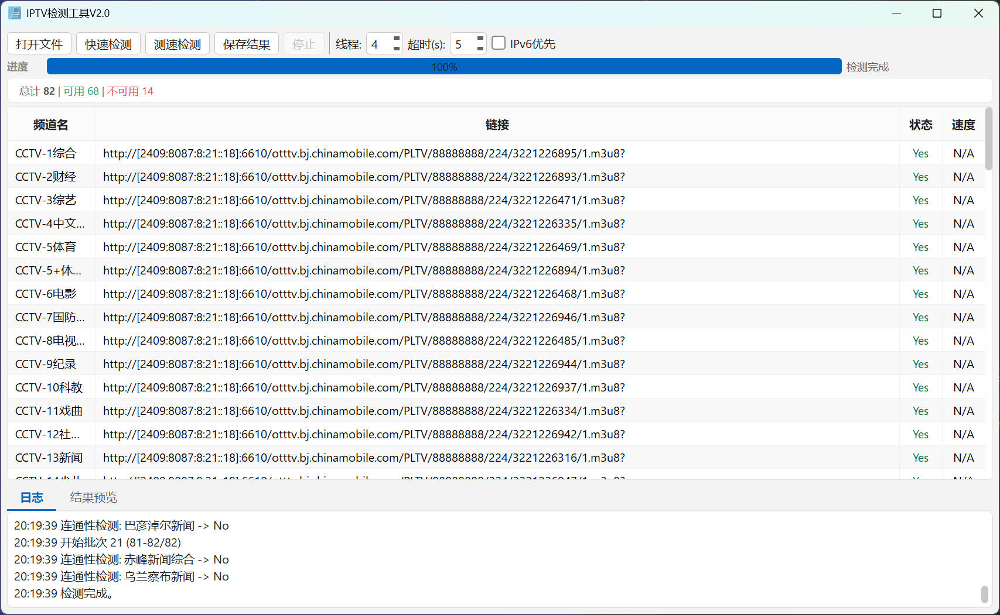

# IPTV Speed Test V2.0

IPTV 直播源检测与测速工具 —— 导入 M3U8 频道列表，批量检测连通性并测速，筛选出可用的直播源。



## 功能特性

- **两阶段检测**：先快速连通性检测，再对可用频道进行下载测速
- **IPv6 优先**：支持强制 IPv6 解析，适用于 IPv6 网络环境更好的场景
- **多线程并发**：可配置线程数，批量检测提高效率
- **实时进度**：进度条 + 阶段标签实时显示检测进度
- **统计面板**：总计 / 可用 / 不可用 / 平均速度一目了然
- **表格交互**：支持按速度排序、右键菜单（复制链接 / 频道名 / 整行 / 删除行）
- **随时取消**：检测过程中可随时停止，已检测的结果保留
- **结果导出**：导出可用频道列表（含/不含速度两份文件）
- **Win11 风格**：Fluent Design 界面风格
- **设置持久化**：线程数、超时、IPv6 偏好等自动保存

## 项目结构

```
IPTV_Test_Speed/
├── main.py                         # 程序入口
├── IPTV_Test.spec                  # PyInstaller 打包配置
├── DownloadM3u.py                  # M3U 源下载脚本（独立工具）
├── core/
│   └── tester.py                   # 核心业务逻辑（连通性 + 测速，纯 Python）
├── workers/
│   └── test_worker.py              # QThread 线程包装层
├── ui/
│   ├── main_window.ui              # Qt Designer 界面文件
│   ├── ui_main_window.py           # pyuic5 自动生成（勿手动编辑）
│   ├── main_window.py              # 主窗口业务逻辑
│   └── win11_style.py              # Win11 QSS 全局样式表
├── module/
│   ├── ReadWriteFile.py            # 频道文件读写
│   ├── Extract_CCTV_Channels.py    # CCTV 频道提取（独立工具）
│   ├── Extract_HK_Channels.py      # 港澳台频道提取（独立工具）
│   └── Extract_SatelliteTv_Channels.py  # 卫视频道提取（独立工具）
├── origin/                         # M3U 源文件（输入）
├── result/                         # 检测结果（输出）
├── icons/
│   └── kenan.ico                   # 应用图标
└── exe/                            # 打包输出目录
```

## 快速开始

### 环境依赖

- Python 3.8+
- PyQt5
- requests
- m3u8

### 从源码运行

```bash
# 安装依赖
pip install PyQt5 requests m3u8

# 运行
python main.py
```

### 使用方法

1. 点击「打开文件」导入 M3U 频道列表（格式：`频道名,链接`，每行一条）
2. 设置线程数、超时时间，按需勾选「IPv6 优先」
3. 点击「开始检测」—— 先进行连通性检测，自动进入测速阶段
4. 检测完成后可按速度排序、右键操作表格
5. 点击「保存结果」导出可用频道列表

### 打包为 EXE

```bash
pyinstaller IPTV_Test.spec
```

打包后的可执行文件位于 `exe/` 目录。

## 输入文件格式

```
CCTV,#genre#
CCTV-1,http://example.com/cctv1.m3u8
CCTV-2,http://example.com/cctv2.m3u8
卫视频道,#genre#
湖南卫视,http://example.com/hntv.m3u8
```

## 输出文件

检测完成后导出两个文件：

| 文件 | 内容 |
|------|------|
| `result.txt` | 可用频道名 + 链接 |
| `result_withSpeed.txt` | 可用频道名 + 链接 + 速度（MB/s） |

## 技术栈

- **GUI**: PyQt5 + Qt Designer
- **架构**: 三层分离（core 纯逻辑 / workers QThread / ui 界面）
- **测速**: 采样 3 个分片计算平均速度
- **IPv6**: patch urllib3 `allowed_gai_family` 实现
- **样式**: QSS 全局样式表（Win11 Fluent Design）

## License

详见 [LICENSE](./LICENSE)
